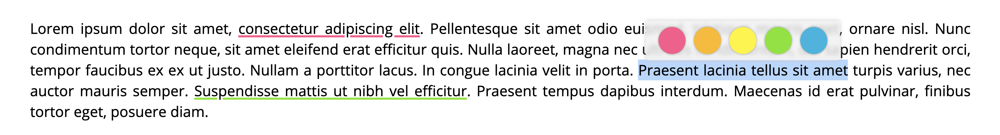

# web-marker


A web page highlighter that features
* accurate serialization and deserialization which makes it possible to correctly restore the highlights, even if part of the web page has changed
* nested highlighting
* configurable overlapping highlight handling
* no runtime-dependency



# How to run
```bash
git clone https://github.com/notelix/web-marker
cd web-marker
npm i
npm start
```

# How to use
```
npm install @notelix/web-marker
```

```javascript
import {Marker} from "@notelix/web-marker"

const marker = new Marker({
    rootElement: document.body,
    eventHandler: {
        onHighlightClick: (context, element) => {
            marker.unpaint(context.serializedRange);
        },
        onHighlightHoverStateChange: (context, element, hovering) => {
            if (hovering) {
                element.style.backgroundColor = "#f0d8ff";
            } else {
                element.style.backgroundColor = "";
            }
        }
    },
    highlightPainter: {
        paintHighlight: (context, element) => {
            element.style.color = "red";
        }
    }
});

marker.addEventListeners();

document.addEventListener('mouseup', (e) => {
    const selection = window.getSelection();
    if (!selection.rangeCount) {
        return null;
    }
    const serialized = marker.serializeRange(selection.getRangeAt(0));
    console.log(JSON.stringify(serialized));
    marker.paint(serialized);
})
```

## Overlapping Highlight Handling

The library supports four modes for handling overlapping highlights:

### Configuration

```javascript
const marker = new Marker({
    rootElement: document.body,
    overlappingHighlight: 'merge', // or 'dontCreateNewHighlight', 'deleteOverlappedHighlight', or 'allow' (default)
    eventHandler: {
        onHighlightDeleted: (context) => {
            // Called when a highlight is automatically deleted due to overlap
            console.log('Highlight deleted:', context.serializedRange.uid);
            // Clean up from your storage here
        }
    }
});
```

### Modes

**`"allow"` (default)**
- Permits overlapping highlights to coexist
- Multiple highlights can exist in the same text region
- Original behavior

**`"dontCreateNewHighlight"`**
- Prevents creating new highlights that overlap with existing ones
- `serializeRange()` returns `null` if overlap is detected
- No existing highlights are modified
- Useful when you want to prevent overlapping annotations

```javascript
const serialized = marker.serializeRange(range);
if (!serialized) {
    alert('Cannot create highlight: overlaps with existing highlight');
} else {
    marker.paint(serialized);
}
```

**`"deleteOverlappedHighlight"`**
- Automatically removes existing highlights that intersect with the new selection
- The `onHighlightDeleted` event handler is called for each deleted highlight
- Allows applications to clean up their state (localStorage, database, etc.)
- Useful when the most recent highlight should take precedence

```javascript
const highlights = {};

const marker = new Marker({
    overlappingHighlight: 'deleteOverlappedHighlight',
    eventHandler: {
        onHighlightDeleted: (context) => {
            const uid = context.serializedRange.uid;
            delete highlights[uid];
            localStorage.setItem('highlights', JSON.stringify(highlights));
        }
    }
});
```

**`"merge"`**
- Automatically expands the selection to encompass all overlapping highlights
- Creates one unified highlight that covers the entire merged range
- Existing overlapping highlights are removed and `onHighlightDeleted` is called for each
- The user's selection visually "snaps" outward to show the merged boundaries
- Useful for combining adjacent or overlapping annotations into a single continuous highlight

```javascript
const highlights = {};

const marker = new Marker({
    overlappingHighlight: 'merge',
    eventHandler: {
        onHighlightDeleted: (context) => {
            // Clean up the old fragments that were merged
            const uid = context.serializedRange.uid;
            delete highlights[uid];
            localStorage.setItem('highlights', JSON.stringify(highlights));
        }
    }
});

// When user creates a highlight that overlaps existing ones,
// it will automatically expand to cover all overlapping highlights
```

# How to build library
```
npm run build-lib
npm pack
```

# Built with web-marker

* [notelix/notelix](https://github.com/notelix/notelix): An open source web note taking / highlighter software (chrome extension with backend)
